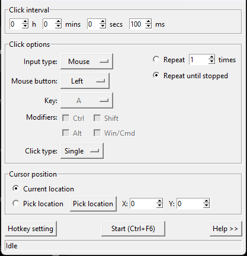

<p align="center">
	
</p>

<p align="center">
	
	
	
	
</p>

## What is AutoKeyPresser?
AutoKeyPresser is an open-source, easy to use, cross-platform auto presser for
**Windows, Linux and macOS**. It can automatically press any keyboard key and
any mouse button, on a classic Windows-style utility interface.


*v1.1*

[](https://www.python.org/)

## Main features
 * Fairly simple, compact layout;
 * Press any keyboard key, with or without modifiers [Ctrl/Shift/Alt/Win];
 * Autoclick with a specified amount of time between each press
   [hours/mins/secs/milliseconds];
 * Choose mouse button [Left/Right/Middle];
 * Choose press type [Single/Double];
 * Repeat until stopped or repeat a given amount of times;
 * Click on the current cursor location or a specified fixed location only;
 * Start / Stop with a custom global hotkey [default F6];
 * Settings are remembered between runs;
 * Checks GitHub Releases for updates and can download the Windows installer.

### How fast can it press?
With a 1 millisecond interval it can easily reach hundreds of presses per
second, far beyond human speed.\
With a 0 millisecond interval, the focused application may freeze.

## Running

Make sure you have the dependencies installed first:

```
pip install -r requirements.txt
```

Then run the app:

```
python main.py
```

Press **Start** or the global hotkey to begin; press it again to stop.

## Permissions

| Platform | Notes |
| --- | --- |
| Windows | Works out of the box. |
| Linux | Requires an X11 session (no Wayland input injection). |
| macOS | Grant the app **Accessibility** and **Input Monitoring** permissions in System Settings → Privacy & Security. |

## Downloads

Every release ships both a **portable** and an **installer** version for each
platform:

| Platform | Portable | Installer |
| --- | --- | --- |
| Windows | `AutoKeyPresser-Portable.zip` (extract & run) | `AutoKeyPresser-Setup.exe` (Inno Setup) |
| Linux | `AutoKeyPresser-Portable-linux.tar.gz` | `AutoKeyPresser-Linux.deb` / `AutoKeyPresser-Linux.AppImage` |
| macOS | `AutoKeyPresser-Portable-macos.zip` (.app) | `AutoKeyPresser-macOS.dmg` |

## Building

After cloning the repository, install PyInstaller and run the build script
for your platform. The artifacts will be placed in **./dist/**.

```
pip install pyinstaller
build.bat           # Windows: portable exe + portable zip + Inno Setup installer
./build_linux.sh    # Linux:   portable tarball + .deb + AppImage (if tooling present)
./build_macos.sh    # macOS:   .app + portable zip + .dmg
```

- The **Windows installer** requires [Inno Setup 6](https://jrsoftware.org/isinfo.php)
  (`winget install -e --id JRSoftware.InnoSetup`).
- The **Linux .deb** needs `dpkg-deb`; the **AppImage** needs `appimagetool`.
- The **macOS .dmg** needs `hdiutil` (bundled with macOS).


## Safety
A 0 ms interval produces a very fast stream of presses. Use the **Stop**
button or the global hotkey to halt immediately. Use responsibly and only on
content you own or are authorized to automate.

## Contributing
All contributions are welcome.
1. Fork the repository.
2. Create a feature branch.
3. Open a pull request.

## License
This project is licensed under the MIT License.

Dependencies are licensed by their own.
